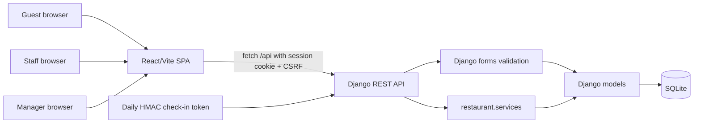

# NextTable

NextTable is a restaurant waitlist and table-management app for a single restaurant. Guests join from a daily check-in URL, staff manage the live waitlist and table states, and managers configure workers, tables, ETA rules, and the notified-guest grace period.

The current architecture is split into a Django REST API backend and a standalone React/Vite frontend. The older Django-template frontend still exists temporarily while the React app is verified and cut over.

## What It Does

NextTable helps a host team handle the core walk-in workflow:

- Guests join the waitlist from a QR-code URL without installing an app.
- Guests can see their private wait status page and cancel when allowed.
- Staff can view active guests, assign tables, and mark guests arrived, seated, left, cancelled, or no-show.
- Staff can track tables through free, reserved, occupied, and cleaning states.
- Managers can create/edit Staff and Manager accounts.
- Managers can configure tables, ETA rules, and the grace period for notified guests.

## Current Status

Implemented:

- Django 5 backend with Django REST Framework API mounted at `/api/`.
- React 19 + TypeScript + Vite frontend in `frontend/`.
- Session-cookie authentication with CSRF protection.
- Local Vite proxy from `/api` to Django on port `8000`.
- API coverage for auth, guest check-in/status/cancel, staff waitlist/table operations, and manager worker/table/ETA configuration.
- Seed command for local demo users, tables, ETA rules, and restaurant settings.

Transitional:

- Old Django template views and templates are still present and still run side-by-side.
- The React SPA is the intended frontend direction, but the old template layer has not been removed yet.
- A built-in manager QR-code display page is not implemented yet.

## Tech Stack

Backend:

- Python 3.12
- Django 5.0.9
- Django REST Framework
- django-cors-headers
- SQLite for local development
- pytest + pytest-django
- uv for Python dependency management

Frontend:

- React 19
- TypeScript
- Vite
- React Router
- Tailwind CSS v4
- npm

## Quickstart

Prerequisites:

- Python 3.12 or newer
- `uv`
- Node.js and npm

Install backend dependencies:

```sh
uv sync
```

Install frontend dependencies:

```sh
cd frontend
npm install
cd ..
```

Create local environment config:

```sh
cp .env.example .env
```

Apply migrations and seed local demo data:

```sh
uv run backend/manage.py migrate
uv run backend/manage.py seed_demo_data
```

Start the Django API backend:

```sh
uv run backend/manage.py runserver
```

In another terminal, start the React frontend:

```sh
cd frontend
npm run dev
```

Open the app:

```text
http://localhost:5173/
```

The Vite dev server proxies `/api/*` to Django at `http://localhost:8000`, so the browser sees API calls as same-origin in local development.

## Demo Accounts

The seed command creates local-only users:

```text
manager_demo / devpassword123
staff_demo / devpassword123
```

Do not use these credentials in production.

Useful React app routes:

```text
/login
/staff
/staff/waitlist
/staff/tables
/manager
/manager/workers
/manager/tables
/manager/eta
```

## Guest Check-In URL

Guest check-in uses a daily token derived from Django's `SECRET_KEY`.

Generate today's local token:

```sh
uv run backend/manage.py shell -c "from restaurant.check_in_tokens import get_current_check_in_token; print(get_current_check_in_token())"
```

Open the React route:

```text
http://localhost:5173/check-in/<token>
```

For a real restaurant, put the deployed frontend URL behind a QR code:

```text
https://your-frontend-domain.example/check-in/<token>
```

The backend validates the token when the frontend calls:

```text
POST /api/check-in/<token>/
```

## Configuration

Backend environment variables live in `.env` at the repository root.

| Variable | Required locally | Purpose |
| --- | --- | --- |
| `SECRET_KEY` | No | Django signing key. Use a real secret outside local development. |
| `DEBUG` | No | Defaults to `True`. Set to `False` outside local development. |
| `ALLOWED_HOSTS` | No | Comma-separated backend hostnames. |
| `FRONTEND_ORIGINS` | No | Comma-separated frontend origins allowed for CORS and CSRF, defaults to `http://localhost:5173`. |

Frontend production builds can use:

| Variable | Required locally | Purpose |
| --- | --- | --- |
| `VITE_API_BASE_URL` | No | API origin for deployed/cross-origin frontend builds. Leave empty in local dev so Vite proxies `/api`. |

Local SQLite data is stored in `db.sqlite3` at the repository root.

## API Overview

The API is mounted under `/api/`.

Auth:

```text
GET  /api/auth/csrf/
POST /api/auth/login/
POST /api/auth/logout/
GET  /api/auth/me/
```

Guest:

```text
GET|POST /api/check-in/<token>/
GET      /api/check-in/status/<public_identifier>/
POST     /api/check-in/status/<public_identifier>/cancel/
```

Staff:

```text
GET  /api/waitlist/
POST /api/waitlist/<entry_id>/action/<action>/
POST /api/waitlist/assign/
GET  /api/tables/
POST /api/tables/<table_id>/status/<target_status>/
```

Manager:

```text
GET|POST /api/workers/
PUT      /api/workers/<user_id>/
GET|POST /api/table-config/
PUT|DELETE /api/table-config/<table_id>/
GET      /api/eta/
POST     /api/eta/rules/
PUT      /api/eta/rules/<rule_id>/
PUT      /api/eta/grace-period/
```

## Testing

Run backend tests:

```sh
uv run pytest
```

Run frontend checks:

```sh
cd frontend
npm run build
npm run lint
```

The backend tests include API tests in `backend/restaurant/api_tests.py` and legacy template-route tests that will need updating or removal once the old Django frontend is cut over.

## Architecture



Core implementation choices:

- React owns the user interface.
- Django REST Framework exposes JSON endpoints under `/api/`.
- Django sessions are used instead of JWT.
- CSRF is handled by `/api/auth/csrf/` plus the `X-CSRFToken` header.
- Local development avoids cross-site cookies by proxying `/api` through Vite.
- Backend API views reuse existing Django forms and service functions to avoid duplicating business validation.
- The Django ORM is used directly.

## Project Structure

```text
backend/
  manage.py
  config/                     Django settings and root URL configuration
  restaurant/
    api/                      DRF serializers, permissions, views, URLs
    models.py                 Restaurant settings, workers, tables, ETA rules, waitlist entries
    forms.py                  Shared validation and save logic
    services.py               Table matching and lifecycle business logic
    tests.py                  Legacy Django-template tests
    api_tests.py              API tests

frontend/
  src/
    App.tsx                   React Router route tree
    lib/api.ts                fetch wrapper with credentials + CSRF
    lib/AuthContext.tsx       session user state
    pages/                    guest, staff, and manager screens
  vite.config.ts              dev proxy for /api
  package.json                frontend scripts and dependencies

docs/
  development.md
  production-checklist.md
  decisions.md
  plan.md
  tasks.md
```

## Data Model

The main domain models are:

- `RestaurantSettings`: singleton restaurant configuration, including grace period.
- `WorkerProfile`: one-to-one role profile for a Django user.
- `RestaurantTable`: physical table, capacity, status, and compatibility metadata.
- `EtaRule`: manager-configured wait estimate by party-size range.
- `WaitlistEntry`: guest waitlist record and lifecycle timestamps.

## Deployment Notes

This repository does not currently include a production deployment target or CI/CD pipeline.

Before a real deployment:

- Set a real `SECRET_KEY`.
- Set `DEBUG=False`.
- Configure `ALLOWED_HOSTS`.
- Configure `FRONTEND_ORIGINS` to the exact deployed frontend origin.
- Configure `VITE_API_BASE_URL` if the frontend and backend are served from different origins.
- Serve both frontend and backend over HTTPS.
- Run migrations against the deployed database.
- Create real staff/manager accounts.
- Do not run `seed_demo_data` against production data.
- Decide deliberately whether SQLite is acceptable for the production target.

## Limitations

- The React SPA is new and still needs final browser parity verification against the old Django-template flows.
- The old Django-template frontend has not been removed yet.
- There is no built-in page that renders today's QR code.
- The app supports one restaurant only; there is no multi-location or multi-tenant model.
- Guest notifications are web-page based; there is no SMS/email integration.
- There is no public hosted demo or CI/CD workflow yet.

## Next Work

- Manually verify every React route in the browser.
- Cut over fully to the React frontend by removing old template views, routes, templates, and old Tailwind/static build artifacts.
- Update `docs/development.md` to match the two-process backend/frontend workflow.
- Add `frontend/.env.example` for `VITE_API_BASE_URL`.
- Add a manager-only QR-code page.

## More Documentation

- Local setup: `docs/development.md`
- Production readiness: `docs/production-checklist.md`
- Product plan: `docs/plan.md`
- Technical decisions: `docs/decisions.md`
- Task backlog/reference: `docs/tasks.md`
